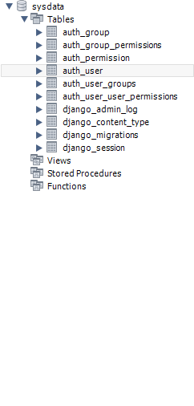

# 修改 页面标题

查看[这里](https://hooray.gitee.io/fantastic-admin/guide/configure.html)

可以看到有三套环境配置

开发环境下的文件.env.development是这样的
```
# 页面标题
VITE_APP_TITLE = Fantastic-admin
# 接口请求地址，会设置到 axios 的 baseURL 参数上
VITE_APP_API_BASEURL = /
# 调试工具，可设置 eruda 或 vconsole，如果不需要开启则留空
VITE_APP_DEBUG_TOOL =

# 是否开启代理
VITE_OPEN_PROXY = false
```
其中 VITE_APP_TITLE VITE_APP_API_BASEURL VITE_APP_DEBUG_TOOL 为必要配置，即不管是在开发、测试，还是生产环境都需要使用到。而其余配置则在不同环境下有不同用途，例如开发环境用于本地开发使用，测试环境和生产环境用于构建使用。  
搜索“VITE_APP_TITLE”发现example\src\views\login.vue里有一行：
```
const title = import.meta.env.VITE_APP_TITLE
```
## vite配置
### 简介
Vite（法语意为 "快速的"，发音 /vit/，发音同 "veet"）是一种新型前端构建工具，能够显著提升前端开发体验。它主要由两部分组成：

一个开发服务器，它基于 原生 ES 模块 提供了 丰富的内建功能，如速度快到惊人的 模块热更新（HMR）。

一套构建指令，它使用 Rollup 打包你的代码，并且它是预配置的，可输出用于生产环境的高度优化过的静态资源。

Vite 意在提供开箱即用的配置，同时它的 插件 API 和 JavaScript API 带来了高度的可扩展性，并有完整的类型支持。

**Vite 通过在一开始将应用中的模块区分为 依赖 和 源码 两类，改进了开发服务器启动时间。**

**依赖** 大多为在开发时不会变动的纯 JavaScript。一些较大的依赖（例如有上百个模块的组件库）处理的代价也很高。依赖也通常会存在多种模块化格式（例如 ESM 或者 CommonJS）。

Vite 将会使用 esbuild 预构建依赖。esbuild 使用 Go 编写，并且比以 JavaScript 编写的打包器预构建依赖快 10-100 倍。

**源码** 通常包含一些并非直接是 JavaScript 的文件，需要转换（例如 JSX，CSS 或者 Vue/Svelte 组件），时常会被编辑。同时，并不是所有的源码都需要同时被加载（例如基于路由拆分的代码模块）。

Vite 以 原生 ESM 方式提供源码。这实际上是让浏览器接管了打包程序的部分工作：Vite 只需要在浏览器请求源码时进行转换并按需提供源码。根据情景动态导入代码，即只在当前屏幕上实际使用时才会被处理。
### 命令行界面
```
{
  "scripts": {
    "dev": "vite", // 启动开发服务器，别名：`vite dev`，`vite serve`
    "build": "vite build", // 为生产环境构建产物
    "preview": "vite preview" // 本地预览生产构建产物
  }
}
```
### index.html 与项目根目录
你可能已经注意到，在一个 Vite 项目中，index.html 在项目最外层而不是在 public 文件夹内。这是有意而为之的：在开发期间 Vite 是一个服务器，而 index.html 是该 Vite 项目的入口文件。

Vite 将 index.html 视为源码和模块图的一部分。Vite 解析``` <script type="module" src="..."> ```，这个标签指向你的 JavaScript 源码。甚至内联引入 JavaScript 的 ```<script type="module">``` 和引用 CSS 的 ```<link href> ```也能利用 Vite 特有的功能被解析。另外，index.html 中的 URL 将被自动转换，因此不再需要 ```%PUBLIC_URL%``` 占位符了。

与静态 HTTP 服务器类似，Vite 也有 “根目录” 的概念，即服务文件的位置，在接下来的文档中你将看到它会以 ```<root> ```代称。源码中的绝对 URL 路径将以项目的 “根” 作为基础来解析，因此你可以像在普通的静态文件服务器上一样编写代码（并且功能更强大！）。Vite 还能够处理依赖关系，解析处于根目录外的文件位置，这使得它即使在基于 monorepo 的方案中也十分有用。

Vite 也支持多个 .html 作入口点的 多页面应用模式。
### 环境变量
Vite 在一个特殊的 import.meta.env 对象上暴露环境变量。这里有一些在所有情况下都可以使用的内建变量：

import.meta.env.MODE: {string} 应用运行的模式。

import.meta.env.BASE_URL: {string} 部署应用时的基本 URL。他由base 配置项决定。

import.meta.env.PROD: {boolean} 应用是否运行在生产环境。

import.meta.env.DEV: {boolean} 应用是否运行在开发环境 (永远与 import.meta.env.PROD相反)。

import.meta.env.SSR: {boolean} 应用是否运行在 server 上

# 修改 logo
将自己的logo.png覆盖example\src\assets\images\logo.png
# 登录框提示由“用户名”修改为“邮箱”
打开example\src\views\login.vue
将用户名改为邮箱后，表单验证的方式也应该改变
原本的表单校验：
```
import type { FormInstance, FormRules } from 'element-plus'
……
const loginRules = ref<FormRules>({
  account: [
    { required: true, trigger: 'blur', message: '请输入用户名' },
  ],
  password: [
    { required: true, trigger: 'blur', message: '请输入密码' },
    { min: 6, max: 18, trigger: 'blur', message: '密码长度为6到18位' },
  ],
})
```
改之后：
```
const resetRules = ref<FormRules>({
  account: [
    { required: true, trigger: 'blur', message: '请输入邮箱' },
    { pattern: /^([a-zA-Z0-9]+[-_\.]?)+@[a-zA-Z0-9]+\.[a-z]+$/ },
  ],
  captcha: [
    { required: true, trigger: 'blur', message: '请输入验证码' },
  ],
  newPassword: [
    { required: true, trigger: 'blur', message: '请输入新密码' },
    { min: 6, max: 18, trigger: 'blur', message: '密码长度为6到18位' },
  ],
})
```
## vue表单校验
参考[https://juejin.cn/post/7124940263981580319](https://juejin.cn/post/7124940263981580319)
# 修改copyright
example\src\settings.default.ts
修改对应值

# 搭建登陆页面的后端
## 后端连接数据库
根据设计文档，我们初步确定登陆部分需要在数据库里创建一个表users, 利用数据库管理软件（我用的是workbench）创建好一个数据库命名为“sysdata”,对应的mysql语句如下：
```
CREATE DATABASE sysdata CHARACTER SET utf8;
```
Django教程[在这里](tutorial_django.md)
创建后端项目：
```
django-admin startproject server
cd server
```
连接数据库：
进入server\server\settings.py，找到：
```
INSTALLED_APPS = [
    "django.contrib.admin",
    "django.contrib.auth",
    "django.contrib.contenttypes",
    "django.contrib.sessions",
    "django.contrib.messages",
    "django.contrib.staticfiles",
]
DATABASES = {
    "default": {
        "ENGINE": "django.db.backends.sqlite3",
        "NAME": BASE_DIR / "db.sqlite3",
    }
}
```
修改成：
```
INSTALLED_APPS = [
    "django.contrib.admin",
    "django.contrib.auth",
    "django.contrib.contenttypes",
    "django.contrib.sessions",
    "django.contrib.messages",
    "django.contrib.staticfiles",
    "rest_framework",
]
DATABASES = {
    "default": {
        "ENGINE": "django.db.backends.mysql",# 设置数据库类型sqlite or mysql or postgresql
        "NAME":"sysData",
        "USER":"root",
        "PASSWORD":"123456",
        "HOST":"localhost",
        "PORT":"3306"
    }
}
```
应用修改：
```
py manage.py migrate
```
创建一个超级管理员
```
py manage.py createsuperuser
```
过程如下：
```
D:\A_GraduationDesign\server>py manage.py createsuperuser
Username (leave blank to use '12081'): admin
Email address: lqq010822@163.com
Password: 
Password (again):
This password is too short. It must contain at least 8 characters.
This password is too common.
This password is entirely numeric.
Bypass password validation and create user anyway? [y/N]: y
Superuser created successfully.
```
启动它：
```
py manage.py runserver
```
在浏览器进入网址：http://127.0.0.1:8000/admin，就进入后台管理界面。  
此时，打开数据库管理软件，看到已经自动创建了这些表（这么老多表，不知道干嘛使得）：

## 创建webapp文件夹
```
django-admin startapp webapp
```
在server\server\settings.py里加入这个文件夹（在server\webapp\apps.py里查找对应名称）：
```
INSTALLED_APPS = [
    "django.contrib.admin",
    "django.contrib.auth",
    "django.contrib.contenttypes",
    "django.contrib.sessions",
    "django.contrib.messages",
    "django.contrib.staticfiles",
    "rest_framework",
    "webapp.apps.WebappConfig",
]
```
## 创建users表
包含用户id、邮箱、密码三个字段要求如下：  
| 字段名 |说明|约束|
|---|---|------|
| uid |用户唯一标识符|非空、主键、唯一|
|email|用户注册邮箱|唯一、非空|
|password|密码|6-20位|

打开server\webapp\models.py，定义Users类:
```
class Users(models.Model):
    uid=models.AutoField(primary_key=True)
    email=models.CharField(max_length=320, unique=True)
    password=models.CharField(max_length=20)
    class Meta:
        db_table='users'
```
字段的定义方法[见这里](https://blog.csdn.net/qq_41865652/article/details/106332865)
## 应用到数据库
```
py manage.py makemigrations webapp
```
生成中间文件webapp/migrations/0001_initial.py
```
py manage.py migrate webapp
```
数据库建好表格
## 为模型创建序列化类
需要创建TutorialSerializer类来管理序列化/反序列化Json数据。  
目标类需要继承rest_framework.serializers.ModelSerializer。父类将自动获取字段集合和验证器。  
新建tutorials/serializers.py文件。
```
from rest_framework import serializers 
from webapp.models import Users


class UsersSerializer(serializers.ModelSerializer):

    class Meta:
        model = Users
        fields = ('uid',
                  'email',
                  'password')
```
## 实现登陆表查询
登录处理流程图如下：

登录的数据流程图如下：

“用户登陆表”含有：email、password
用户填写“用户登陆表”后，与数据库里的“用户表”里的数据进行对比，正确则返回状态码(200)[（查看状态码相关解释）](https://blog.csdn.net/a15561415881/article/details/84953049)以及用户uid、email，存储到客户端浏览器；否则返回错误状态码(400)。  

在server\webapp\views.py里定义登录的接口：
```
from django.shortcuts import render
from django.http.response import JsonResponse
from rest_framework.parsers import JSONParser 
from rest_framework import status

from webapp.models import Users
from webapp.serializers import UsersSerializer
from rest_framework.decorators import api_view
# Create your views here.
@api_view(['POST'])
def users_login(request):
    if request.method == 'POST':
        email=request.POST.get("email")
        password=request.POST.get("password")
        try:
            anyone=Users.objects.get(email=email,password=password)
        except Users.DoesNotExist:
            return JsonResponse(status=status.HTTP_400_BAD_REQUEST)
        data = {
            "email":anyone['email'],
            "uid":anyone['uid']
        }
        return JsonResponse(data, status=status.HTTP_200_OK) 
```
新建server\webapp\urls.py：
```
from django.conf.urls import url 
from webapp import views 

urlpatterns = [ 
    url(r'^api/login$', views.users_login),
]
```
把app的路由添加到项目的urlpatterns中。
```
from django.contrib import admin
from django.urls import path
from django.conf.urls import url, include

urlpatterns = [
    path("admin/", admin.site.urls),
    url(r'^', include('wenbapp.urls')),
]
```
## 测试
```
python manage.py runserver
```

## 实现注册表查询
注册处理流程图如下：

注册的数据流程图如下：

“用户注册表”含有：email、password、验证码
用户填写“email”后，点击“验证”。与数据库里的“用户表”里的数据进行对比，若不存在该邮箱则生成验证码并存储到cache[（配置以及教程）](https://django-redis-chs.readthedocs.io/zh_CN/latest/)里，向邮箱发送验证码并返回状态码(200)；否则返回状态码并且提示用户“该邮箱已经注册”。  
用户在**5分钟**（验证码有效时间）内填写“用户注册表”后，将数据返回后端并存储到数据库
  
随便新建一个邮箱：  
systest202307@163.com  
密码：Lqq123456
在“设置”里打开IMAP/SMTP、POP3.得到密匙：  
IMAP/SMTP：MCFVFQFDHOUYQIQC
在settings.py里配置：
```
# 邮件配置
# 发送邮箱验证码
EMAIL_HOST = "smtp.163.com"     # 服务器
EMAIL_PORT = 25                 # 一般情况下都为25
EMAIL_HOST_USER = "systest202307@163.com"     # 账号
EMAIL_HOST_PASSWORD = "MCFVFQFDHOUYQIQC"     # （上面保存的密钥）
EMAIL_USE_TLS = False       # 一般都为False
EMAIL_FROM = "systest202307@163.com"      # 邮箱来自
```
参考：https://blog.csdn.net/Sun_White_Boy/article/details/80722879  

在server\webapp\views.py里定义验证、注册的接口：
```
from django.shortcuts import render
from django.http.response import JsonResponse
from rest_framework.parsers import JSONParser 
from rest_framework import status
from django.core.cache import cache  # 存入redis

from webapp.models import Users
from webapp.serializers import UsersSerializer
from rest_framework.decorators import api_view

# 生成随机字符串
def generate_random_str(randomlength=6):
    str = ''
    chars = 'AaBbCcDdEeFfGgHhIiJjKkLlMmNnOoPpQqRrSsTtUuVvWwXxYyZz0123456789'
    length = len(chars)-1
    random = Random()
    for i in range(randomlength):
        str+=chars[random.randint(0, length)]
    return str
@api_view(['POST'])
def users_captcha(request):
    if request.method == 'POST':
        email=request.POST.get("email")
        try:
            anyone=Users.objects.get(email=email)
        except Users.DoesNotExist:#如果不存在该email
            code=generate_random_str()
            key='captcha_'+email
            # 发送验证码
            cache.set(key, code, 30)  # 5分钟的有效时间
            return JsonResponse(status=status.HTTP_200_OK)
        if anyone:#该邮箱已注册
            return JsonResponse(udata, status=status.HTTP_500_INTERNAL_SERVER_ERROR)

@api_view(['POST'])
def users_register(request):
    if request.method == 'POST':
        email=request.POST.get("email")
        password=request.POST.get("password")
        captcha=request.POST.get("captcha")
        code = cache.get('captcha_'+email)
        if not code:# 验证码失效
            return JsonResponse(udata, status=status.HTTP_500_INTERNAL_SERVER_ERROR)
        if code==captcha:# 注册成功
            newuser=Users(email=email,password=password)
            newuser.save()
            return JsonResponse(status=status.HTTP_200_OK)

```

新建server\webapp\urls.py：
```
from django.conf.urls import url 
from webapp import views 

urlpatterns = [ 
    url(r'^api/login$', views.users_login),
]
```
把app的路由添加到项目的urlpatterns中。
```
from django.contrib import admin
from django.urls import path
from django.conf.urls import url, include

urlpatterns = [
    path("admin/", admin.site.urls),
    url(r'^', include('wenbapp.urls')),
]
```
## 测试
```
python manage.py runserver
```