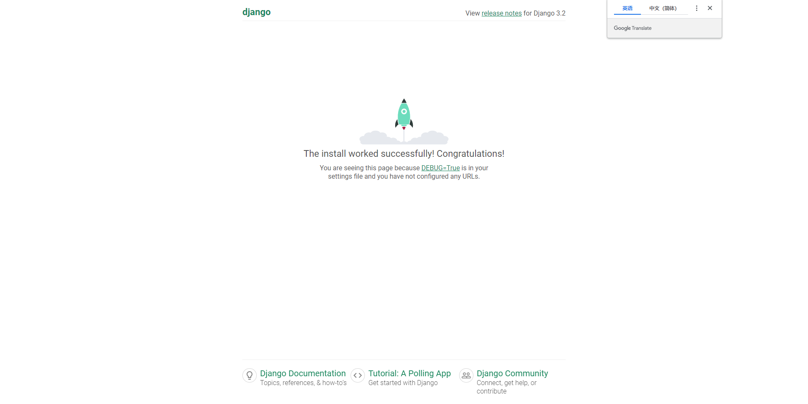

[<-vue+vite+django后段搭建项目](login.md)  
# 创建项目
如果你通过 pip 安装 Django，django-admin 脚本应该在你的系统路径中。  
如果你通过anaconda虚拟环境下载，请确保你的虚拟环境已经被激活。（activate 虚拟环境名称）  
下载完django后，在cmd文件输入
```
D:
cd A_GraduationDesign
django-admin startproject mysite
```
# 理解：mysite文件结构
可以看到在D:/A_GraduationDesign文件夹下产生了一个新的文件夹mysite，目录结构如下：
```
mysite/
    manage.py
    mysite/
        __init__.py
        settings.py
        urls.py
        asgi.py
        wsgi.py
```
最外层的 mysite/ 根目录只是你项目的容器， 根目录名称对 Django 没有影响，你可以将它重命名为任何你喜欢的名称。  
## manage.py
 一个让你用各种方式管理 Django 项目的命令行工具。
内容：
```
#!/usr/bin/env python
"""Django's command-line utility for administrative tasks."""
import os
import sys


def main():
    """Run administrative tasks."""
    os.environ.setdefault('DJANGO_SETTINGS_MODULE', 'mysite.settings')

    #os.environ是os包里的字典对象，可以查看环境变量
    #os.environ.setdefault('DJANGO_SETTINGS_MODULE','mysite.settings') #设置环境变量DJANGO_SETTINGS_MODULE的值为'mysite.settings'

    try:
        from django.core.management import execute_from_command_line
    except ImportError as exc:
        raise ImportError(
            "Couldn't import Django. Are you sure it's installed and "
            "available on your PYTHONPATH environment variable? Did you "
            "forget to activate a virtual environment?"
        ) from exc
    execute_from_command_line(sys.argv)


if __name__ == '__main__':
    main()
```
最简单的运行，往往是：

**python manage.py runserver 0.0.0.0:8000**

进入最初的manage.py文件，我们看到：

execute_from_command_line(sys.argv)
这一句很简单的命令。而这个命令，来自：

from django.core.management import execute_from_command_line

这里的sys.argv，实际上是：

**['manage.py', 'runserver', '0.0.0.0:8000']**

而在execute_from_command_line函数里，实际上，是生成ManagementUtility类，并运行：execute方法
### ManagementUtility类  
   
**ManagementUtility类**，位于django.core.management目录下的__init__.py文件。

这个类，在其init中：
```
def __init__(self, argv=None):
    self.argv = argv or sys.argv[:]
　　#各个参数
    self.prog_name = os.path.basename(self.argv[0]) 
　　#这里是去除路径
    self.settings_exception = None
```

然后就是```main_help_text，fetch_command，autocomplete，execute```四个函数。

下面，仔细分析一下 **execute**这个函数：
```
try:
    subcommand = self.argv[1]
except IndexError:
    subcommand = 'help'  # Display help if no arguments were given.
```
注释写的很明白，如果没有参数，那就把help作为参数赋值进去。

```
# Preprocess options to extract --settings and --pythonpath.
# These options could affect the commands that are available, so they
# must be processed early.
```
后续，需要对诸如--settings和--pythonpath等参数进行抽取，预处理。因为这些的设置会影响其他参数的运行。
```
parser = CommandParser(None, usage="%(prog)s subcommand [options] [args]", add_help=False)
```
这里，又调用了**CommandParser**类（后续分析）。
```
parser.add_argument('--settings')
parser.add_argument('--pythonpath')
parser.add_argument('args', nargs='*')  # catch-all
try:
    options, args = parser.parse_known_args(self.argv[2:])
    handle_default_options(options)
except CommandError:
    pass  # Ignore any option errors at this point.
```
这里，在分析透彻CommandParser后，可以更好的理解。
```
try:
    settings.INSTALLED_APPS
　　#这里的settings = LazySettings()，在conf/__init__.py定义的。
　　#而LazySettings是一个类，继承自：LazyObject，后续分析。

except ImproperlyConfigured as exc:
    self.settings_exception = exc
```
## mysite/\_\_init\_\_.py
**里面一层的 mysite/ 目录包含你的项目，它是一个纯 Python 包。它的名字就是当你引用它内部任何东西时需要用到的 Python 包名。 (比如 mysite.urls).**  
一个空文件，告诉 Python 这个目录应该被认为是一个 Python 包。如果你是 Python 初学者，阅读官方文档中的 更多关于包的知识。
## mysite/settings.py
Django 项目的配置文件。
## mysite/urls.py
Django 项目的 URL 声明，就像你网站的“目录”。
## mysite/asgi.py
作为你的项目的运行在 ASGI 兼容的 Web 服务器上的入口。
## mysite/wsgi.py
作为你的项目的运行在 WSGI 兼容的Web服务器上的入口。
# 启动
```
cd mysite
py manage.py runserver
```
在浏览器输入网址：```http://127.0.0.1:8000/```,如下页面表示成功启动

你已经启动了 Django 开发服务器，这是一个用纯 Python 编写的轻量级网络服务器。我们在 Django 中包含了这个服务器，所以你可以快速开发，而不需要处理配置生产服务器的问题 -- 比如 Apache -- 直到你准备好用于生产。
现在是个提醒你的好时机：千万不要 将这个服务器用于和生产环境相关的任何地方。这个服务器只是为了开发而设计的。
# 创建应用
现在你的开发环境——这个“项目” ——已经配置好了，你可以开始干活了。
在 Django 中，每一个**应用**都是一个 Python 包，并且遵循着相同的约定。Django 自带一个工具，可以帮你生成应用的基础目录结构，这样你就能专心写代码，而不是创建目录了。

## 理解：项目 VS 应用

项目和应用有什么区别？应用是一个专门做某件事的网络应用程序——比如博客系统，或者公共记录的数据库，或者小型的投票程序。项目则是一个网站使用的配置和应用的集合。项目可以包含很多个应用。应用可以被很多个项目使用。  
你的应用可以存放在任何 Python 路径 中定义的路径。在这个教程中，我们将在你的 manage.py 同级目录下创建投票应用。这样它就可以作为顶级模块导入，而不是 mysite 的子模块。
## 做法
请确定你现在处于 manage.py 所在的目录下，然后运行这行命令来创建一个应用：
```
py manage.py startapp polls
```
polls是应用名（文件夹名）
## 理解：polls文件结构
目录结构如下：
```
polls/
    __init__.py
    admin.py
    apps.py
    migrations/
        __init__.py
    models.py
    tests.py
    views.py
```
# 编写第一个视图
打开polls/views.py,写入:
```
from django.http import HttpResponse


def index(request):
    return HttpResponse("Hello, world. You're at the polls index.")
```
这是 Django 中最简单的视图。如果想看见效果，我们需要将一个 URL 映射到它——这就是我们需要 URLconf 的原因了。
新建urls.py后，目录结构如下:
```
polls/
    __init__.py
    admin.py
    apps.py
    migrations/
        __init__.py
    models.py
    tests.py
    urls.py
    views.py
```
urls.py内容：
```
from django.urls import path

from . import views

urlpatterns = [
    path("", views.index, name="index"),
]
```
下一步是要在根 URLconf 文件中指定我们创建的 polls.urls 模块。在 mysite/urls.py 文件的 urlpatterns 列表里插入一个 include()， 如下：
```
from django.contrib import admin
from django.urls import include, path

urlpatterns = [
    path("polls/", include("polls.urls")),
    path("admin/", admin.site.urls),
]
```
现在运行它：
```
py manage.py runserver
```
打开http://localhost:8000/polls/
# 理解：URL调度器
## Django 如何处理一个请求
当一个用户请求 Django 站点的一个页面，下面是 Django 系统决定执行哪个 Python 代码使用的算法：

1. Django 确定使用根 URLconf 模块。通常，这是 ROOT_URLCONF（在settings.py文件夹里的字段） 设置的值，但如果传入 HttpRequest 对象拥有 urlconf 属性（通过中间件设置），它的值将被用来代替 ROOT_URLCONF 设置。
2. Django 加载该 Python 模块并寻找可用的 urlpatterns 。它是 django.urls.path() 和(或) django.urls.re_path() 实例的数组（如上面的polls/urls.py文件的urlpatterns就是这种数组）。
3. Django 会按顺序遍历每个 URL 模式，然后会在所请求的URL匹配到第一个模式后停止，并与 path_info 匹配。
4. 一旦有 URL 匹配成功，Djagno 导入并调用相关的视图，这个视图是一个Python 函数（或基于类的视图 class-based view ）。视图会获得如下参数：
   1. 一个 HttpRequest 实例。
   2. 如果匹配的 URL 包含未命名组，那么来自正则表达式中的匹配项将作为位置参数提供。
   3. 关键字参数由路径表达式匹配的任何命名部分组成，并由 django.urls.path() 或 django.urls.re_path() 的可选 kwargs 参数中指定的任何参数覆盖。
5. 如果没有 URL 被匹配，或者匹配过程中出现了异常，Django 会调用一个适当的错误处理视图。参加下面的错误处理( Error handling )。
## path
## re_path
## include
## error handing
# 配置数据库
现在，打开 mysite/settings.py 。这是个包含了 Django 项目设置的 Python 模块。

通常，这个配置文件使用 SQLite 作为默认数据库。如果你不熟悉数据库，或者只是想尝试下 Django，这是最简单的选择。Python 内置 SQLite，所以你无需安装额外东西来使用它。[相关配置教程](https://docs.djangoproject.com/zh-hans/4.2/intro/tutorial02/)

但是，如果你像我一样需要其他的数据库，你需要安装合适的 database bindings ，然后改变设置文件中 DATABASES 'default' 项目中的一些键值.

下面以Mysql为例配置数据库，[更多其他的数据库请看这里](https://docs.djangoproject.com/zh-hans/4.2/topics/install/#database-installation)  
首先，我假设你已经安装配置好了Mysql,[没有的话点这里看教程](https://blog.csdn.net/SoloVersion/article/details/123760428)。在命令行或新建mysql数据库：
```
mysql -u root -p
#输入密码
CREATE DATABASE sysData CHARACTER SET utf8;
```
在mysite/settings.py里配置：
```
DATABASES = {
    "default": {
        "ENGINE": "django.db.backends.mysql",# 设置数据库类型sqlite or mysql or postgresql
        "NAME":"sysData",
        "USER":"root",
        "PASSWORD":"123456",
        "HOST":"localhost",
        "PORT":"3306"
    }
}
```
# 配置redis
缓存，用来存放用户session信息、短信验证码、图形验证码等。
```
pip install -i https://pypi.douban.com/simple django-redis
```
在mysite/setting.py里配置：
```
CACHES = {
    "default": {
        "BACKEND": "django_redis.cache.RedisCache",
        "LOCATION": "redis://127.0.0.1:6379/0",
        "OPTIONS": {
            "CLIENT_CLASS": "django_redis.client.DefaultClient",
        }
    },
}
```
# 运行
```
py manage.py migrate
```
这个 migrate 命令查看 INSTALLED_APPS 配置，并根据 mysite/settings.py 文件中的数据库配置和随应用提供的数据库迁移文件（我们将在后面介绍这些），创建任何必要的数据库表。  
你会看到它应用的每一个迁移都有一个消息。如果你有兴趣，运行你的数据库的命令行客户端，输入 \dt （PostgreSQL）， SHOW TABLES; （MariaDB，MySQL）， .tables （SQLite）或 SELECT TABLE_NAME FROM USER_TABLES; （Oracle）来显示 Django 创建的表。
# 创建模型
即创建数据库里的表和表里的字段
例子：在这个投票应用中，需要创建两个模型：问题 Question 和选项 Choice。Question 模型包括问题描述和发布时间。Choice 模型有两个字段，选项描述和当前得票数。每个选项属于一个问题。
这些概念可以通过一个 Python 类来描述。按照下面的例子来编辑 polls/models.py 文件：
```
from django.db import models
class Question(models.Model):
    question_text = models.CharField(max_length=200)
    pub_date = models.DateTimeField("date published")

class Choice(models.Model):
    question = models.ForeignKey(Question, on_delete=models.CASCADE)
    choice_text = models.CharField(max_length=200)
    votes = models.IntegerField(default=0)
```
## 数据库外键约束
CASCADE
在父表上update/delete记录时，同步update/delete掉子表的匹配记录 

SET NULL
在父表上update/delete记录时，将子表上匹配记录的列设为null (要注意子表的外键列不能为not null)  

NO ACTION
如果子表中有匹配的记录,则不允许对父表对应候选键进行update/delete操作  

RESTRICT
同no action, 都是立即检查外键约束

SET DEFAULT
父表有变更时,子表将外键列设置成一个默认的值 但Innodb不能识别
# 激活模型
上面的一小段用于创建模型的代码给了 Django 很多信息，通过这些信息，Django 可以：
1. 为这个应用创建数据库 schema（生成 CREATE TABLE 语句）。
2. 创建可以与 Question 和 Choice 对象进行交互的 Python 数据库 API。

但是首先得把 polls 应用安装到我们的项目里。
为了在我们的工程中包含这个应用，我们需要在配置类 INSTALLED_APPS 中添加设置。

因为 PollsConfig 类写在文件 polls/apps.py 中，所以它的点式路径是 'polls.apps.PollsConfig'。  
在文件 mysite/settings.py 中 INSTALLED_APPS 子项添加点式路径后，它看起来像这样：
```
INSTALLED_APPS = [
    "polls.apps.PollsConfig",
    "django.contrib.admin",
    "django.contrib.auth",
    "django.contrib.contenttypes",
    "django.contrib.sessions",
    "django.contrib.messages",
    "django.contrib.staticfiles",
]
```
现在你的 Django 项目会包含 polls 应用。接着运行下面的命令：
```
py manage.py makemigrations polls
```
结果：
```
D:\A_GraduationDesign\mysite>py manage.py makemigrations polls
Migrations for 'polls':
  polls\migrations\0001_initial.py
    - Create model Question
    - Create model Choice
```
通过运行 makemigrations 命令，Django 会检测你对模型文件的修改（在这种情况下，你已经取得了新的），并且把修改的部分储存为一次 迁移。  
迁移是 Django 对于模型定义（也就是你的数据库结构）的变化的储存形式 - 它们其实也只是一些你磁盘上的文件。如果你想的话，你可以阅读一下你模型的迁移数据，它被储存在 polls/migrations/0001_initial.py 里。别担心，你不需要每次都阅读迁移文件，但是它们被设计成人类可读的形式，这是为了便于你手动调整 Django 的修改方式。

Django 有一个自动执行数据库迁移并同步管理你的数据库结构的命令 - 这个命令是 migrate，我们马上就会接触它 - 但是首先，让我们看看迁移命令会执行哪些 SQL 语句。sqlmigrate 命令接收一个迁移的名称，然后返回对应的 SQL：
```
py manage.py sqlmigrate polls 0001
```
你将会看到类似下面这样的输出（我把输出重组成了人类可读的格式）：
```
--
-- Create model Question
--
CREATE TABLE `polls_question` (`id` bigint AUTO_INCREMENT NOT NULL PRIMARY KEY, `question_text` varchar(200) NOT NULL, `pub_date` datetime(6) NOT NULL);
--
-- Create model Choice
--
CREATE TABLE `polls_choice` (`id` bigint AUTO_INCREMENT NOT NULL PRIMARY KEY, `choice_text` varchar(200) NOT NULL, `votes` integer NOT NULL, `question_id` bigint NOT NULL);
ALTER TABLE `polls_choice` ADD CONSTRAINT `polls_choice_question_id_c5b4b260_fk_polls_question_id` FOREIGN KEY (`question_id`) REFERENCES `polls_question` (`id`);
```
请注意以下几点：
1. 输出的内容和你使用的数据库有关。
2. 数据库的表名是由应用名(polls)和模型名的小写形式( question 和 choice)连接而来。（如果需要，你可以自定义此行为。）
3. 主键(IDs)会被自动创建。(当然，你也可以自定义。)
4. 默认的，Django 会在外键字段名后追加字符串 "_id" 。（同样，这也可以自定义。）
5. 它是为你正在使用的数据库定制的，因此特定于数据库的字段类型，例如“auto_increment”（MySQL）、“bigint PRIMARY KEY GENERATED BY DEFAULT AS IDENTITY”（PostgreSQL）或“integer primary key autoincrement” `` (SQLite) 会自动为您处理。 字段名称的引用也是如此——例如，使用双引号或单引号。
6. 这个 sqlmigrate 命令并没有真正在你的数据库中的执行迁移 - 相反，它只是把命令输出到屏幕上，让你看看 Django 认为需要执行哪些 SQL 语句。这在你想看看 Django 到底准备做什么，或者当你是数据库管理员，需要写脚本来批量处理数据库时会很有用。
如果你感兴趣，你也可以试试运行 python manage.py check ;这个命令帮助你检查项目中的问题，并且在检查过程中不会对数据库进行任何操作。

现在，再次运行 migrate 命令，在数据库里创建新定义的模型的数据表：
```
py manage.py migrate
```
这个 migrate 命令选中所有还没有执行过的迁移（Django 通过在数据库中创建一个特殊的表 django_migrations 来跟踪执行过哪些迁移）并应用在数据库上 - 也就是将你对模型的更改同步到数据库结构上。
# 总结：如何改变模型
迁移是非常强大的功能，它能让你在开发过程中持续的改变数据库结构而不需要重新删除和创建表 - 它专注于使数据库平滑升级而不会丢失数据。我们会在后面的教程中更加深入的学习这部分内容，现在，你只需要记住，改变模型需要这三步：

编辑 models.py 文件，改变模型。  
运行 python manage.py makemigrations 为模型的改变生成迁移文件。  
运行 python manage.py migrate 来应用数据库迁移。  

数据库迁移被分解成生成和应用两个命令是为了让你能够在代码控制系统上提交迁移数据并使其能在多个应用里使用；这不仅仅会让开发更加简单，也给别的开发者和生产环境中的使用带来方便。